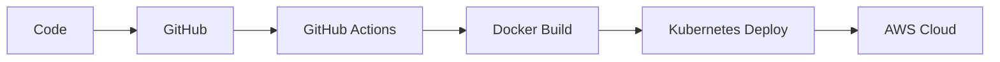

<!-- ========================================================= -->
<!--                  ⚡ PREMIUM GITHUB README                 -->
<!-- ========================================================= -->

<h1 align="center">
  
</h1>

<p align="center">
  
</p>

---

<p align="center">

<a href="https://github.com/ashutosh-kumar-01">
  
</a>

<a href="https://www.linkedin.com/in/ashutoshkumar69/">
  
</a>

<a href="mailto:yourmail@gmail.com">
  
</a>


</p>

---

# 🌌 About Me


```yaml
Name: Ashutosh Kumar

Role:
  - Full Stack MERN Developer
  - DevOps & Cloud Engineer

Education:
  - B.Tech Computer Science
  - Lovely Professional University

Focus:
  - Scalable Web Applications
  - Cloud Native Systems
  - DevOps Automation
  - Backend Engineering

Currently Learning:
  - Kubernetes
  - Terraform
  - AWS Architecture
  - System Design

Achievements:
  - Solved 1000+ DSA Problems
  - Strong Problem Solving Skills
```

---

# ⚡ Tech Stack

---

## 👨‍💻 Programming Languages

<p align="center">

</p>

---

## 🎨 Frontend Development

<p align="center">

</p>

---

## ⚙️ Backend Development

<p align="center">

</p>

---

## 🗄️ Database & ORM

<p align="center">

</p>

---

## ☁️ DevOps & Cloud

<p align="center">

</p>

<p align="center">


</p>

---

# 🧠 Core Skills

```yaml
Frontend:
  - React.js
  - Next.js
  - Tailwind CSS
  - Redux

Backend:
  - Node.js
  - Express.js
  - NestJS
  - REST APIs
  - GraphQL

Databases:
  - MongoDB
  - PostgreSQL
  - Redis
  - Prisma ORM

DevOps:
  - Docker
  - Kubernetes
  - Jenkins
  - GitHub Actions
  - Terraform
  - AWS

Programming:
  - Data Structures & Algorithms
  - OOP
  - System Design
```

---

# 🏆 GitHub Trophies

<p align="center">

</p>

---

# 📊 GitHub Analytics

<p align="center">


</p>

---

# 🔥 GitHub Streak

<p align="center">

</p>

---

# 📈 Contribution Graph

<p align="center">

</p>

---

# 🚀 DevOps Workflow



---

# 🧩 Architecture Mindset

```txt
✔ Scalable Web Applications
✔ REST API Design
✔ Authentication Systems
✔ Cloud Native Development
✔ Containerized Deployments
✔ CI/CD Automation
✔ Infrastructure as Code
✔ High Performance Backend Systems
```

---

# 🏆 LeetCode Stats

<p align="center">

</p>

---

# 🥇 LeetCode Badges

<p align="center">


</p>

---

# 🌍 Connect With Me

<p align="center">

<a href="https://www.linkedin.com/in/ashutoshkumar69/">
  
</a>

<a href="https://github.com/ashutosh-kumar-01">
  
</a>

<a href="mailto:yourmail@gmail.com">
  
</a>

</p>

---

# ✨ Random Dev Quote

<p align="center">

</p>

---

# 🐍 Contribution Snake

<p align="center">

</p>

---

# 🎵 Spotify Playing

<p align="center">

</p>

---

# 💻 Coding Profiles

<p align="center">

<a href="https://leetcode.com/ashutosh7761/">
  
</a>

<a href="https://github.com/ashutosh-kumar-01">
  
</a>

</p>

---

# ⚡ Fun Fact

```txt
I love building scalable systems,
automating workflows,
and turning ideas into production-ready applications 🚀
```

---

<h1 align="center">

✨ Code • Build • Deploy • Repeat ✨

</h1>

<p align="center">

</p>
