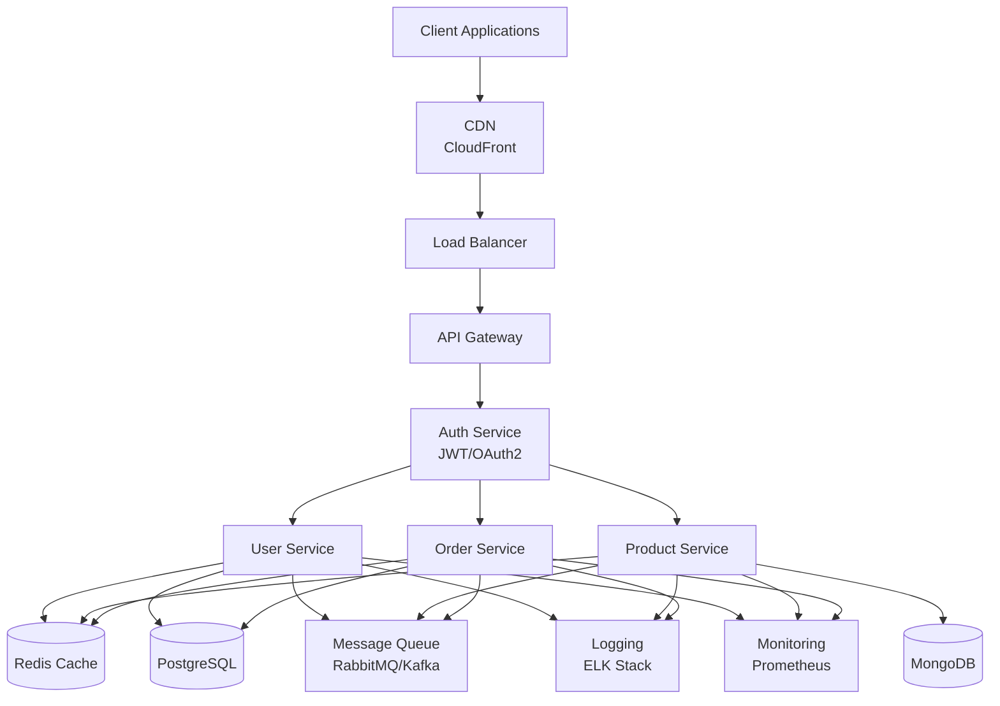
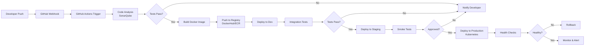

<!-- ========================================================= -->
<!--          🌟 ADVANCED GITHUB PROFILE PORTFOLIO              -->
<!-- ========================================================= -->

<h1 align="center">
  
</h1>

<p align="center">
  
</p>

---

<div align="center">

[](https://www.linkedin.com/in/ashutoshkumar69/)
[](https://github.com/ashutosh-kumar-01)
[](mailto:yourmail@gmail.com)
[](https://leetcode.com/ashutosh7761/)
[](https://your-portfolio.com)


</div>

---

## 🎯 Professional Summary


```yaml
👤 Full Stack MERN Developer | DevOps Engineer | Cloud Architect

📍 Location: India
🎓 Education: B.Tech Computer Science - Lovely Professional University
💼 Experience: Building scalable systems, microservices & cloud-native applications
⚡ Specialization: Full-stack development, containerization, infrastructure automation

🎯 Core Expertise:
  ✅ Enterprise-level Web Applications
  ✅ Microservices Architecture
  ✅ Kubernetes Orchestration
  ✅ CI/CD Pipeline Automation
  ✅ Cloud Infrastructure (AWS)
  ✅ System Design & Optimization

🏆 Achievements:
  ⭐ 1000+ DSA Problems Solved
  ⭐ Advanced Problem-Solving Skills
  ⭐ Multiple Production Deployments
  ⭐ Open Source Contributions

🚀 Currently Exploring:
  → Advanced Kubernetes patterns
  → Infrastructure as Code (Terraform)
  → AWS Solutions Architecture
  → System Design Patterns
  → Machine Learning Integration
```

---

## 💻 Technology Stack

### 🔤 Programming Languages

<div align="center">

</div>

**Proficiency Levels:**
- ⭐⭐⭐⭐⭐ JavaScript/TypeScript, Python, Java
- ⭐⭐⭐⭐ C++, Bash, SQL
- ⭐⭐⭐ PHP, Go, CSS

---

### 🎨 Frontend Technologies

<div align="center">

</div>

| Technology | Proficiency | Experience |
|-----------|------------|-----------|
| **React.js** | ⭐⭐⭐⭐⭐ | 3+ years |
| **Next.js** | ⭐⭐⭐⭐⭐ | 2+ years |
| **Tailwind CSS** | ⭐⭐⭐⭐⭐ | 2+ years |
| **Redux/Zustand** | ⭐⭐⭐⭐ | 2+ years |
| **Material-UI** | ⭐⭐⭐⭐ | 1+ year |

**Specializations:**
- State Management & Performance Optimization
- Component Library Development
- Progressive Web Apps (PWA)
- Real-time Applications

---

### ⚙️ Backend Technologies

<div align="center">

</div>

| Framework | Proficiency | Expertise |
|-----------|------------|----------|
| **Node.js** | ⭐⭐⭐⭐⭐ | Runtime & Async |
| **Express.js** | ⭐⭐⭐⭐⭐ | RESTful APIs |
| **NestJS** | ⭐⭐⭐⭐ | Enterprise Apps |
| **GraphQL** | ⭐⭐⭐⭐ | API Design |

**Core Competencies:**
- RESTful & GraphQL API Design
- Authentication & Authorization (JWT, OAuth2)
- Real-time Communication (WebSockets)
- Microservices Architecture
- API Gateway Patterns

---

### 🗄️ Database & Data Solutions

<div align="center">

</div>

| Database | Type | Proficiency |
|----------|------|------------|
| **MongoDB** | NoSQL | ⭐⭐⭐⭐⭐ |
| **PostgreSQL** | SQL | ⭐⭐⭐⭐⭐ |
| **Redis** | Cache/Store | ⭐⭐⭐⭐ |
| **MySQL** | SQL | ⭐⭐⭐⭐ |
| **Firebase** | BaaS | ⭐⭐⭐⭐ |

**Advanced Skills:**
- Database Design & Optimization
- Query Optimization & Indexing
- Caching Strategies (Redis)
- Database Replication & Sharding
- Transaction Management

---

### 🚀 DevOps & Cloud Infrastructure

<div align="center">

</div>

| Tool | Proficiency | Application |
|------|------------|-------------|
| **Docker** | ⭐⭐⭐⭐⭐ | Containerization |
| **Kubernetes** | ⭐⭐⭐⭐ | Orchestration |
| **AWS** | ⭐⭐⭐⭐ | Cloud Infra |
| **GitHub Actions** | ⭐⭐⭐⭐ | CI/CD |
| **Terraform** | ⭐⭐⭐⭐ | IaC |
| **Jenkins** | ⭐⭐⭐⭐ | Pipeline Automation |

**AWS Services:**
- EC2, S3, RDS, DynamoDB
- VPC, CloudFront, Load Balancing
- Lambda, API Gateway
- CloudWatch, CloudFormation

**DevOps Specialization:**
- Container Orchestration with K8s
- CI/CD Pipeline Design
- Infrastructure as Code (Terraform, CloudFormation)
- Monitoring & Logging (ELK Stack)
- Security & Compliance Automation

---

### 📊 Additional Tools & Technologies

<div align="center">


</div>

---

## 🏗️ Architecture & System Design



---

## 🔄 DevOps Workflow & CI/CD Pipeline



---

## 📚 Core Competencies

### Backend Development
```yaml
✨ Microservices Architecture
✨ RESTful API Design
✨ GraphQL Implementation
✨ Authentication & Authorization
✨ Real-time Communication
✨ Payment Integration
✨ Email & Notification Systems
✨ File Upload & Processing
```

### Frontend Development
```yaml
✨ Component-Driven Development
✨ State Management
✨ Performance Optimization
✨ Responsive Design
✨ Progressive Web Apps
✨ Accessibility (A11y)
✨ Testing & QA
✨ Browser Compatibility
```

### DevOps & Infrastructure
```yaml
✨ Container Orchestration
✨ Infrastructure as Code
✨ CI/CD Pipeline Design
✨ Kubernetes Deployment
✨ Cloud Architecture
✨ Monitoring & Observability
✨ Security Hardening
✨ Disaster Recovery & Backup
```

### Database & Data
```yaml
✨ Database Design & Normalization
✨ Query Optimization
✨ Indexing Strategies
✨ Replication & Sharding
✨ ACID Transactions
✨ NoSQL Document Design
✨ Caching Patterns
✨ Data Migration
```

---

## 🏆 GitHub Trophies

<p align="center">

</p>

---

## 📊 GitHub Statistics

<div align="center">

<table>
<tr>
<td width="50%" align="center">

### 📈 Profile Stats


</td>
<td width="50%" align="center">

### 🔝 Top Languages


</td>
</tr>
</table>

### 🔥 GitHub Streak


</div>

---

## 🎯 LeetCode & Competitive Programming

<div align="center">

### 📊 LeetCode Statistics


### 🥇 LeetCode Achievements
<p>


</p>

**Statistics:**
- ✅ 1000+ Problems Solved
- ✅ Multiple Contests Participated
- ✅ Consistent Daily Problem Solving
- ✅ Advanced Algorithm Proficiency

</div>

---

## 💡 Technical Blog Highlights

I share insights on:
- **Cloud Architecture Patterns** - Scalable system design
- **DevOps Best Practices** - CI/CD, containerization
- **Full Stack Development** - MERN stack patterns
- **System Design** - Distributed systems
- **Performance Optimization** - Backend & frontend

> 📝 Check out my articles and technical deep-dives on [LinkedIn](https://www.linkedin.com/in/ashutoshkumar69/) and [Portfolio](https://your-portfolio.com)

---

## 🎓 Certifications & Learning

| Certification | Issuer | Status |
|--------------|--------|--------|
| **AWS Certified Solutions Architect** | Amazon Web Services | 📚 In Progress |
| **Kubernetes Administrator (CKA)** | Linux Foundation | 📚 In Progress |
| **Docker Certified Associate** | Docker | ✅ Completed |
| **Full Stack Web Development** | Udemy | ✅ Completed |

---

## 🤝 Open Source Contributions

I actively contribute to:
- Web development frameworks
- DevOps tooling
- Cloud-native projects
- Developer tools

> **Looking to collaborate?** Open issues and PRs are welcome! 🚀

---

## 📞 Let's Connect & Collaborate

<div align="center">

I'm always interested in:
- 🚀 Challenging full-stack projects
- 🏗️ DevOps and infrastructure challenges
- 🌍 Open-source collaborations
- 💬 Technical discussions & mentoring
- 🤝 Partnership opportunities

### Reach Out:

[](mailto:yourmail@gmail.com)
[](https://www.linkedin.com/in/ashutoshkumar69/)
[](https://github.com/ashutosh-kumar-01)
[](https://your-portfolio.com)

</div>

---

## 💻 Code Quality & Best Practices

<div align="center">


**Commitments:**
- ✅ Clean Code Practices (SOLID Principles)
- ✅ Comprehensive Testing (Unit, Integration, E2E)
- ✅ Detailed Documentation
- ✅ Performance Optimization
- ✅ Security Best Practices
- ✅ Accessibility Standards

</div>

---

## 🎵 Dev Vibes

<p align="center">

</p>

---

## 🌟 Random Dev Wisdom

<p align="center">

</p>

---

## 🚀 Key Takeaways

```
┌─────────────────────────────────────────────────┐
│                                                 │
│  💡 Build Scalable Systems                      │
│  🔒 Write Secure Code                           │
│  📊 Optimize Performance                        │
│  🧪 Test Everything                            │
│  📚 Document Thoroughly                        │
│  🤝 Collaborate Effectively                    │
│  🚀 Deploy with Confidence                     │
│  📈 Monitor & Improve                          │
│                                                 │
│        Code • Build • Deploy • Repeat          │
│                                                 │
└─────────────────────────────────────────────────┘
```

---

<p align="center">

</p>

<div align="center">

**Made with ❤️ by Ashutosh Kumar | Last Updated: 2026**

</div>